# **Behavioral Cloning** 


**Behavioral Cloning Project**

The goals / steps of this project are the following:
* Use the simulator to collect data of good driving behavior
* Build, a convolution neural network in Keras that predicts steering angles from images
* Train and validate the model with a training and validation set
* Test that the model successfully drives around track one without leaving the road
* Summarize the results with a written report


[//]: # (Image References)

## Rubric Points
### Here I will consider the [rubric points](https://review.udacity.com/#!/rubrics/432/view) individually and describe how I addressed each point in my implementation.  

---
### Files Submitted & Code Quality

#### 1. Submission includes all required files and can be used to run the simulator in autonomous mode

My project includes the following files:
* model.py containing the script to create and train the model
* drive.py for driving the car in autonomous mode
* model.h5 containing a trained convolution neural network 
* README.md summarizing the results

#### 2. Submission includes functional code
Using the Udacity provided simulator and my drive.py file, the car can be driven autonomously around the track by executing 
```sh
python drive.py model.h5
```

#### 3. Submission code is usable and readable

The model.py file contains the code for training and saving the convolution neural network. The file shows the pipeline I used for training and validating the model, and it contains comments to explain how the code works.

### Model Architecture and Training Strategy

#### 1. An appropriate model architecture has been employed

I am using the model architecture proposed by nvidia in this article - 
[End-to-End Deep Learning for Self-Driving Cars](https://devblogs.nvidia.com/deep-learning-self-driving-cars/).

The following images shows the CNN archtecture proposed by Nvidia.


<center> Source - Nvidia </center>

This model (starting from the bottom) contains a normalization layer which uses kera lambda layers, followed by 5 Convolution layers (model.py line 86-96).

The output from the convolution layers are fattened and passed through 3 fully connected layers (model.py line 99-104).

 ELU (Exponentail Linear Unit) is used as activation function to introduce nonlinearity.

#### 2. Attempts to reduce overfitting in the model

The model contains dropout layer in order to reduce overfitting (model.py lines 101). 

The model was trained and validated on different data sets to ensure that the model was not overfitting (code line 10-16). The model was tested by running it through the simulator and ensuring that the vehicle could stay on the track.

#### 3. Model parameter tuning

The model used an adam optimizer, so the learning rate was not tuned manually (model.py line 106).

#### 4. Appropriate training data

Training data was chosen to keep the vehicle driving on the road. I used a combination of center lane driving, recovering from the left and right sides of the road.

For details about how I created the training data, see the next section. 

### Model Architecture and Training Strategy

#### 1. Solution Design Approach

My first step was to use a convolution neural network model similar to the one proposed by Nvidia team in [End-to-End Deep Learning for Self-Driving Cars](https://devblogs.nvidia.com/deep-learning-self-driving-cars/). I thought this model might be appropriate because it is a very powerful network with a lot of layers and is proven to give good results.

In order to gauge how well the model was working, I split my image and steering angle data into a training and validation set. I found that my first model had a low mean squared error on the training set but a high mean squared error on the validation set. This implied that the model was overfitting. 

To combat the overfitting, I modified the model by adding a dropout layer in between the fully connected layers (model.py line 101)

The final step was to run the simulator to see how well the car was driving around track one. There were a few spots where the vehicle fell off the track. To improve the driving behavior in these cases, I collected to more data and converted the RGB image to YUV as mentioned in the Nvidia article. I also batch normalized the data between the convolution layers for better results.

At the end of the process, the vehicle is able to drive autonomously around the track without leaving the road.

#### 2. Final Model Architecture

The final model architecture (model.py lines 18-24) consisted of a convolution neural network with the following layers 0- 

```
________________________________________________________________
Layer (type)                 Output Shape              Param #   
=================================================================
lambda_1 (Lambda)            (None, 160, 320, 3)       0         
_________________________________________________________________
cropping2d_1 (Cropping2D)    (None, 65, 320, 3)        0         
_________________________________________________________________
conv2d_1 (Conv2D)            (None, 31, 158, 24)       1824      
_________________________________________________________________
batch_normalization_1 (Batch (None, 31, 158, 24)       96        
_________________________________________________________________
conv2d_2 (Conv2D)            (None, 14, 77, 36)        21636     
_________________________________________________________________
batch_normalization_2 (Batch (None, 14, 77, 36)        144       
_________________________________________________________________
conv2d_3 (Conv2D)            (None, 5, 37, 48)         43248     
_________________________________________________________________
batch_normalization_3 (Batch (None, 5, 37, 48)         192       
_________________________________________________________________
conv2d_4 (Conv2D)            (None, 3, 35, 64)         27712     
_________________________________________________________________
batch_normalization_4 (Batch (None, 3, 35, 64)         256       
_________________________________________________________________
conv2d_5 (Conv2D)            (None, 1, 33, 64)         36928     
_________________________________________________________________
batch_normalization_5 (Batch (None, 1, 33, 64)         256       
_________________________________________________________________
flatten_1 (Flatten)          (None, 2112)              0         
_________________________________________________________________
dense_1 (Dense)              (None, 100)               211300    
_________________________________________________________________
dropout_1 (Dropout)          (None, 100)               0         
_________________________________________________________________
dense_2 (Dense)              (None, 50)                5050      
_________________________________________________________________
dense_3 (Dense)              (None, 10)                510       
_________________________________________________________________
dense_4 (Dense)              (None, 1)                 11        
=================================================================

```

Here is a visualization of the architecture 

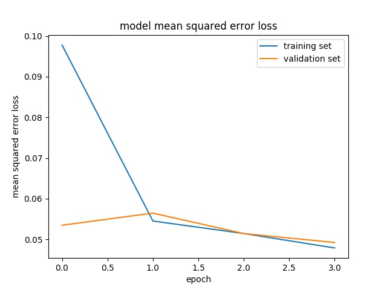

#### 3. Creation of the Training Set & Training Process

To capture good driving behavior, I first recorded two laps on track one using center lane driving. Here is an example image of center lane driving:

<center>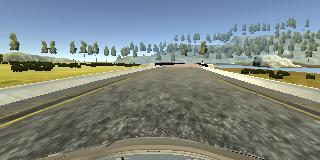</center>
<center>Center</center>
<center>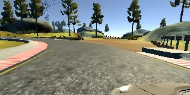</center>
<center>Left</center>
<center>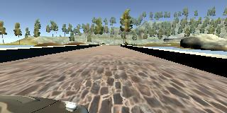</center>
<center>Right</center>

I then recorded the vehicle recovering from the left side and right sides of the road back to center so that the vehicle would learn to recover from the road sides. These images show what a recovery looks like starting from right to center


<center>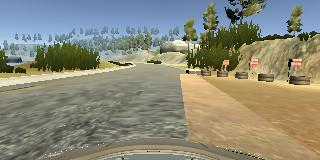</center>
<center>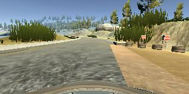</center>
<center>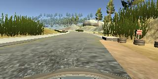</center>
<center>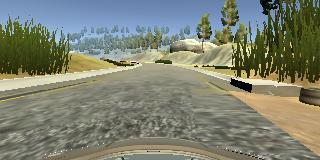</center>
<center>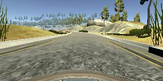</center>
<center>Recovery</center>

Then I repeated this process on track two in order to get more data points.

<center>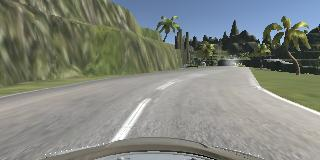</center>
<center>Track 2</center>


To augment the data set, I converted the RGB images to YUV color space for better results.

<center>
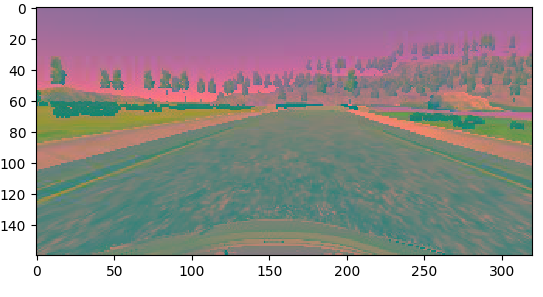
</center>

The images were cropped to remove the unnecessary objects. 

<center>
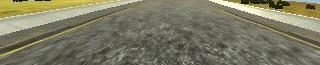
</center>

After the collection process, I had 349,163 number of data points. I then preprocessed this data by converting to YUV color space and cropping as mentioned above.


I finally randomly shuffled the data set and put 20% of the data into a validation set. 

I used this training data for training the model. The validation set helped determine if the model was over or under fitting. I got better results when I used 4 EPOCHS. I used an adam optimizer so that manually training the learning rate wasn't necessary.
 